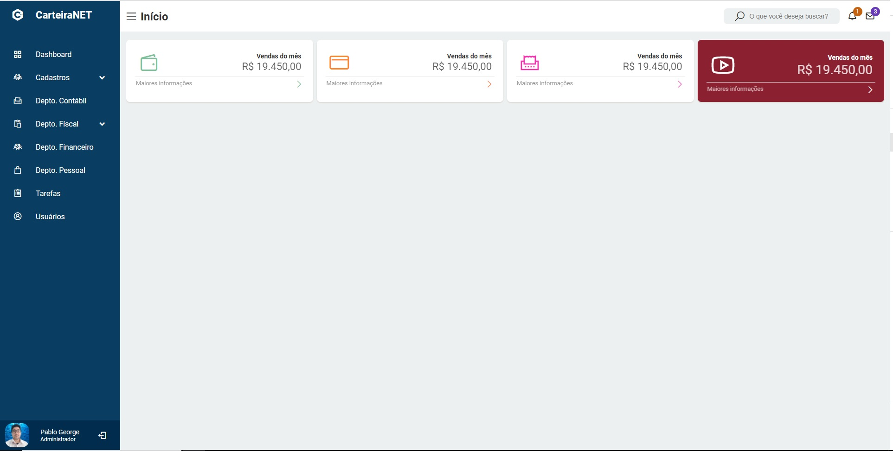

<div align="center">
<a href="https://github.com/pablogeokar/nextjs-sc-dashboard/stargazers"></a>
<a href="https://github.com/pablogeokar/nextjs-sc-dashboard/network"></a>
<a href="https://github.com/pablogeokar/nextjs-sc-dashboard/issues"></a>
 <a href="https://github.com/pablogeokar/nextjs-sc-dashboard/blob/main/LICENSE"></a>
 
</div>

<div>

</div>

## 1 - Configurando o tema

As configurações iniciais do tema estão em `src/pages/_app_.tsx`

```javascript
const theme = {
  colors: {
    primary: "#0a3d62",
    sidebar: "#0a3d62",
    sidebarHover: "#012c4d",
    sidebarActiveColor: "#0ab4df",
  },
  sidebar: {
    width: "260px",
  },
};
```

## 2 - Configurando as opções da Sidebar

Editar o arquivo `config/sidebar.json`

```json
[
  {
    "label": "Dashboard",
    "iconClass": "bx bx-grid-alt",
    "path": "/"
  },
  {
    "label": "Cadastros",
    "iconClass": "las la-users",
    "subMenu": [
      {
        "label": "Clientes",
        "path": "#"
      },
      {
        "label": "Empresas",
        "path": "#"
      }
    ]
  }
]
```
